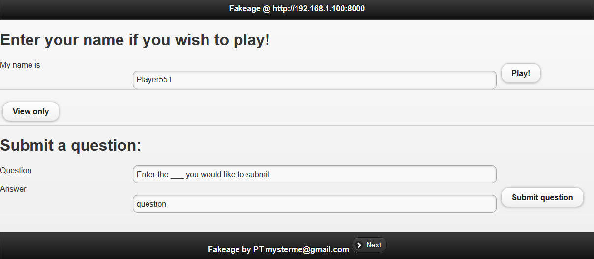

# Fakeage - a Local area network (e.g. WiFi) Fibbage-like lying game
-
### How to play

Add your questions (tab separated questions and answers) to [questions.tsv](questions.tsv).  
Launch fakeage_server.py, direct browsers to http://[my.local.ip]:8000/  
Have one browser tab as the 'viewer' on the tv/projector/main display. Click the >NEXT button on the footer bar to advance through lying-lie selection-scoring rounds.   

All input from players will be butchered to remove all non [A-Z] [0-9] characters to preserve the developer's sanity, and converted to UPPERCASE.  
Supports players rejoining with the same names, supports liking of submissions.   
1 point for getting the correct answer, 1 point for fooling others.   

---

### To build or dev

Two main components are 

* [fakeage_server.py](fakeage_server.py), which contains the server code, and 
* [index.html](index.html), which contains the viewer/player javascript stuff. 

Reel in horror at the spaghetti code in the python side, get further enraged by the code on the browser side. 

Requires a few python libs, see [requirements.txt](requirements.txt).

To run a server, launch fakeage_server.py

Standalone exe built with `pyinstaller --onefile fakeage_server.py` (might be out of date).

Have fun!

---

